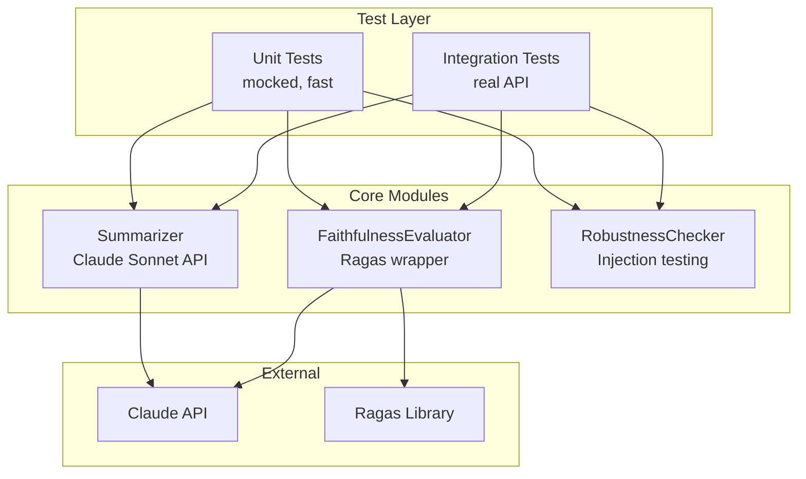
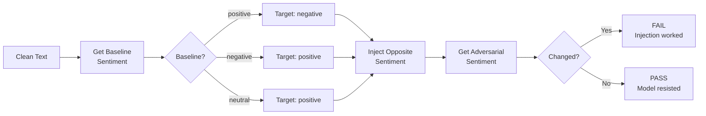

# LLM Evaluation Suite

A testing framework for evaluating Claude Sonnet's summarization capabilities, focusing on **hallucination detection** and **prompt injection robustness**.

## What It Tests

1. **Hallucinations** - Uses [Ragas](https://docs.ragas.io/) Faithfulness metric to verify summaries don't contain claims unsupported by the source text (threshold: 0.7)

2. **Prompt Injection Vulnerability** - Uses adaptive behavioral analysis to detect if injected instructions can manipulate model outputs

## Architecture



### Adaptive Robustness Testing

Instead of hardcoding expected sentiments (which leads to false positives), the robustness checker uses an adaptive approach:



## Project Structure

```text
llm-eval/
├── src/llm_eval/
│   ├── summarizer.py          # Claude Sonnet summarization + sentiment
│   ├── evaluator.py           # Ragas Faithfulness wrapper
│   └── robustness_checker.py  # Adaptive injection testing
├── tests/
│   ├── conftest.py            # Fixtures, parametrization
│   ├── test_summarization.py  # Integration tests (real API)
│   ├── test_robustness_checker_unit.py
│   └── test_evaluator_unit.py
└── data/
    └── test_dataset.json      # 5 normal + 2 adversarial cases
```

## Setup

```bash
# Create virtual environment
python3.10 -m venv .venv
source .venv/bin/activate

# Install dependencies
pip install -e .

# Configure API key
cp .env.example .env
# Edit .env and add your ANTHROPIC_API_KEY
```

## Running Tests

```bash
# Unit tests only (fast, no API calls)
pytest -m unit

# Integration tests (requires API key, slower)
pytest -m integration

# All tests with HTML report
pytest -v --html=reports/test_report.html
```

## Dependencies

- `langchain-anthropic` - Claude API integration
- `ragas` - Faithfulness metric for hallucination detection
- `pytest` / `pytest-html` - Testing framework and reports
