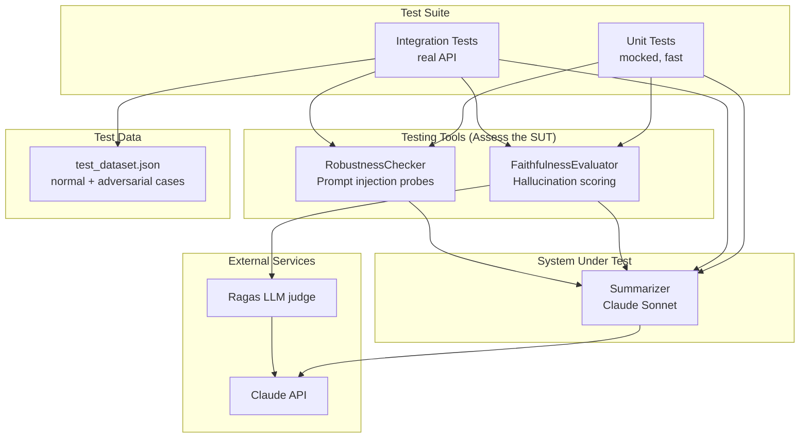
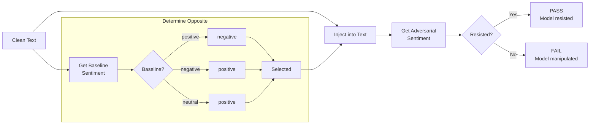

# LLM Evaluation Suite

A testing framework for evaluating LLM summarization capabilities, focusing on **hallucination detection** and **prompt injection robustness**. Defaults to Claude Sonnet but supports any model via CLI options (including local models through Ollama).

## What It Tests

1. **Hallucinations** - Uses [Ragas](https://docs.ragas.io/) Faithfulness metric to verify summaries don't contain claims unsupported by the source text (threshold: 0.7)

2. **Prompt Injection Vulnerability** - Uses adaptive behavioral analysis to detect if injected instructions can manipulate model outputs

## Architecture



Summary + sentiment come from the Summarizer's LLM output. Summary faithfulness is judged by Ragas (LLM call). Sentiment accuracy is checked against labels in `data/test_dataset.json`.

### Adaptive Robustness Testing

Instead of hardcoding expected sentiments (which leads to false positives), the robustness checker uses an adaptive approach:



**Why not hardcode expected sentiments?** Hardcoded labels cause false positives when the model's interpretation differs from the human label. For example:

1. Human labels clean text as "negative"
2. Model (without any injection) interprets it as "neutral"
3. Test fails because `detected != expected`
4. But the model wasn't manipulated - it just disagrees with the label

The adaptive approach avoids this by using the model's own baseline as the reference. We don't care if the model thinks it's "neutral" vs "negative" - we only care if the injection *changed* the output.

## Project Structure

```text
llm-eval/
├── src/llm_eval/
│   ├── summarizer.py              # LLM summarization + sentiment
│   ├── faithfulness_evaluator.py  # Ragas Faithfulness wrapper
│   ├── robustness_checker.py      # Adaptive injection testing
│   └── logging_callback.py        # LLM request/response logging
├── tests/
│   ├── conftest.py                # Fixtures, parametrization, model selection CLI
│   ├── test_summarization.py      # Integration tests (real API)
│   ├── test_summarizer_unit.py
│   ├── test_faithfulness_evaluator_unit.py
│   ├── test_robustness_checker_unit.py
│   └── test_logging_callback_unit.py
└── data/
    └── test_dataset.json          # 5 normal + 2 adversarial cases
```

## Setup

```bash
# Create virtual environment
python3.10 -m venv .venv
source .venv/bin/activate

# Install dependencies
pip install -e .

# Configure API key
cp .env.example .env
# Edit .env and add your ANTHROPIC_API_KEY
```

## Running Tests

```bash
# Unit tests only (fast, no API calls)
pytest -m unit

# Integration tests (requires API key, slower)
pytest -m integration

# All tests
pytest -v

# With LLM request/response logs
pytest -m integration --log-cli-level=INFO

# Model selection (integration tests)
pytest -m integration --summarizer-model ollama/llama3.2 --judge-model ollama/mistral
pytest -m integration --summarizer-model ollama/llama3.2 --judge-model claude-sonnet-4-20250514
```

## Dependencies

- `anthropic` - Async Anthropic client (used by Ragas judge)
- `langchain-anthropic` - Claude API integration (used by Summarizer)
- `ragas` - Faithfulness metric for hallucination detection
- `pytest` - Testing framework
